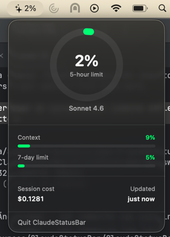

# ClaudeStatusBar

A native macOS menu bar app showing your Claude Code plan usage in real time.

Click the icon to see a popover with context window %, session cost, and model name.



## Requirements

- macOS 13+
- Swift 5.9+
- `jq` — `brew install jq`

## Setup

**1. Install the hook:**

```bash
mkdir -p ~/.claude/hooks
cp hooks/stop_hook.sh ~/.claude/hooks/stop_hook.sh
chmod +x ~/.claude/hooks/stop_hook.sh
```

**2. Register the hook** — add to `~/.claude/settings.json`:

```json
{
  "statusLine": {
    "type": "command",
    "command": "~/.claude/hooks/stop_hook.sh"
  }
}
```

**3. Build and run:**

```bash
cd ~/ClaudeStatusBar
swift build -c release
.build/release/ClaudeStatusBar
```

**4. Auto-start on login (optional):**

macOS LaunchAgents are small service definitions that start automatically on login. This step registers ClaudeStatusBar as a LaunchAgent so it runs in the menu bar without needing to start it manually.

Copy the bundled LaunchAgent plist to the macOS system folder where login items are registered:
```bash
cp com.local.claudestatusbar.plist ~/Library/LaunchAgents/
```

Replace the `YOUR_USERNAME` placeholder — `$(whoami)` is substituted automatically with your macOS username:
```bash
sed -i '' "s/YOUR_USERNAME/$(whoami)/" ~/Library/LaunchAgents/com.local.claudestatusbar.plist
```

Register and start the LaunchAgent (if it was previously loaded, unload first):
```bash
launchctl unload ~/Library/LaunchAgents/com.local.claudestatusbar.plist 2>/dev/null; launchctl load ~/Library/LaunchAgents/com.local.claudestatusbar.plist
```

To unregister (stops auto-start and kills the running process):
```bash
launchctl unload ~/Library/LaunchAgents/com.local.claudestatusbar.plist
```

## How it works

- **Menu bar %** — fetched from the Anthropic OAuth API every minute using your stored Claude Code credentials
- **Popover details** — written by `~/.claude/hooks/stop_hook.sh` after every Claude response, watched via `DispatchSource`
- **Stale indicator** — label dims if no response has been received in the last 5 minutes

## Troubleshooting

| Symptom | Fix |
|---|---|
| Icon shows `--` | Normal at startup — populates within seconds. If it persists, run `claude /login` |
| 5-hour % never changes | Re-authenticate: `claude /login` |
| Popover data doesn't update | Check the hook is registered in `settings.json` and `jq` is installed |
| `launchctl load` fails with "Input/output error" | The plist needs `LimitLoadToSessionType = Aqua` — required for GUI/menu bar apps. Copy the bundled `com.local.claudestatusbar.plist` which already includes it. |
